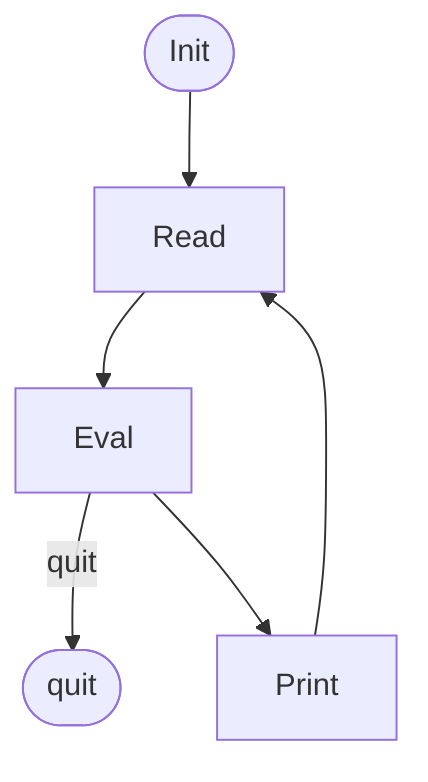

# Micromaid
Micromaid is a small subset of [Mermaid](https://mermaid.live/) for Pharo 13 and later.

## Embed diagrams in Microdown documents

You can embed a micromaid script in [Microdown](https://github.com/pillar-markup/Microdown) documents, including class comments.
For example, if your class has a comment as below,

````text
I am a REPL interpreter.

````
you'll have the following presentation on the browser.


BTW, Mermaid will render it like the below.


