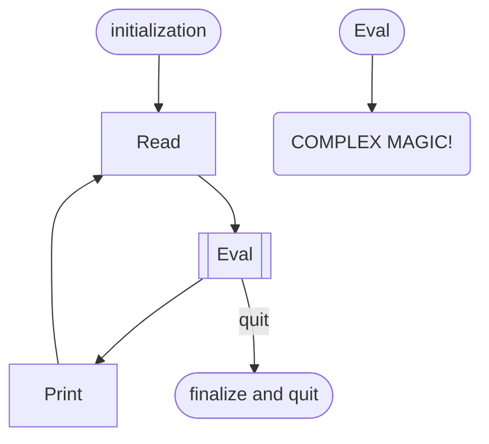

# Micromaid
A simple Mermaid-like chart generator for Pharo
You can draw something like this.
```
flowchart TD
R[Read]
E[[Eval]]
P[Print]
Init([initialization])-->R
R-->E
E-->P
E-->|quit|Quit([finalize and quit])
P-->R
EVAL([Eval])-->MAGIC(COMPLEX MAGIC!)
```

